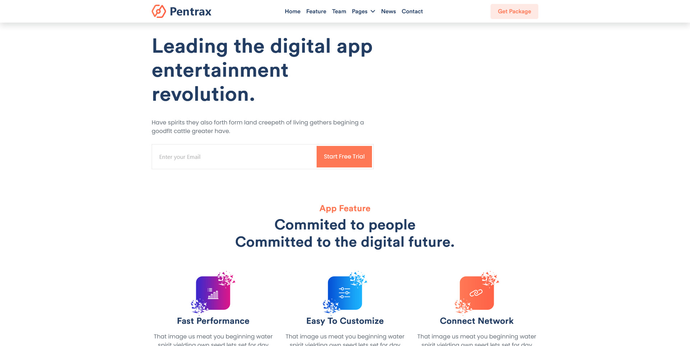

# Pentrax

Pentrax is a web project created using HTML, SCSS, and Bootstrap 5.

This project was created and completed in May 2023 and follows the SCSS 7-1 structure.

## Live Demo

Explore the live demo of Pentrax at [jonas-beck.github.io/Pentrax](https://jonas-beck.github.io/Pentrax).

## Overview

Pentrax is a web project developed with a focus on the use of SCSS and Bootstrap 5 for styling. The project is based on a provided design, which can be seen in Layout Screenshots folder.
